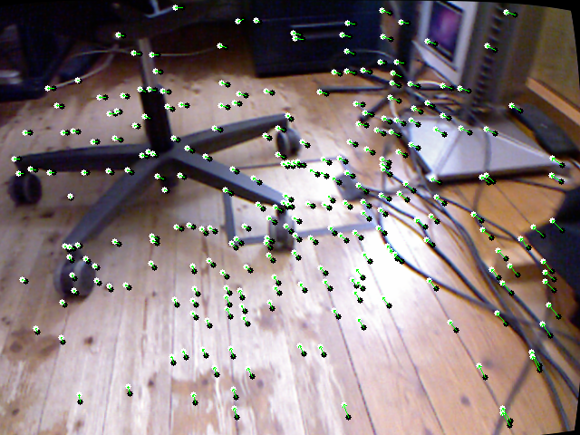
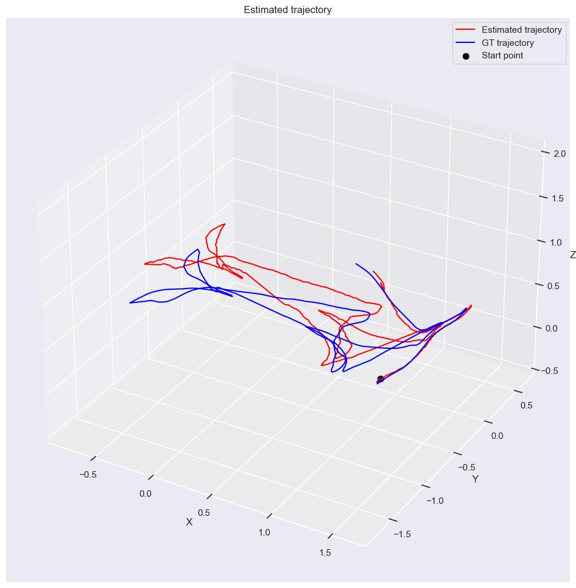
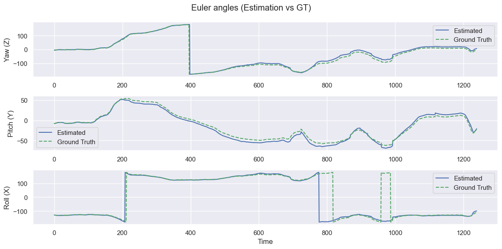

# Visual Odometry Using SuperPoint and Kria KV260 Hardware Acceleration

This project implements **visual odometry** using the pretrained neural network [SuperPoint](https://github.com/magicleap/SuperPointPretrainedNetwork), which detects keypoints and extracts local descriptors from images. The model has been quantized and optimized to run on the Xilinx Kria KV260 platform using the Vitis AI toolkit.

## Project Goals

- Apply the SuperPoint model for visual odometry (estimating the trajectory of a camera from video frames),
- Optimize and deploy the model on embedded hardware (Kria KV260 FPGA),
- Compare performance between the original and quantized versions of the model.

## How It Works

The project estimates the **camera trajectory** (its position and orientation in space) from a sequence of input images. Such approaches are commonly used in autonomous robots, drones, and vehicles.

### Main Processing Steps

1. **Keypoint Detection**  
   For each frame, the **SuperPoint** network is used to detect keypoints and extract corresponding descriptors that capture local image features.

2. **Keypoint Matching**  
   Keypoints between consecutive frames are matched using either a simple Brute-Force (BF) matcher or the more advanced **SuperGlue** model, which leverages spatial context.

3. **Outlier Rejection**  
   To eliminate incorrect matches (outliers), a **homography** is estimated between frames, and RANSAC is used to filter inconsistent points.

4. **Motion Estimation**  
   Based on the filtered keypoint pairs, the relative camera motion is estimated via **rotation** and **translation** matrices.  
   The project supports two approaches:
   - **With depth information** (e.g. from depth maps or stereo): 3D pose estimation,
   - **Without depth**: using only 2D projections for approximate motion estimation.

## Repository Structure

The project is organized into several modules:

### 📁 `src/`
Contains source files responsible for the entire visual odometry pipeline and evaluation.  
To run visual odometry on PC (without quantization), use:
```bash
python src/launch_new.py
```

### 📁 Quantization/
Contains scripts for:

- **Quantizing** the SuperPoint network,
- **Compiling** the model for deployment on the **Kria KV260 DPU**.

> 🚀 To run this part, use the **Vitis AI Docker image**.

### 📁 Kria_run/
Contains scripts for:

- Running the compiled model,
- Evaluating the model on the target hardware (**Kria KV260**).

## Datasets

The project was tested on the following datasets:

- [HPatches](https://github.com/hpatches/hpatches-dataset) – for feature matching evaluation,
- [KITTI](http://www.cvlibs.net/datasets/kitti/) – for outdoor visual odometry,
- [TUM RGB-D](https://vision.in.tum.de/data/datasets/rgbd-dataset) – for indoor RGB-D sequences.

## Visualizations

Below are example results generated by the visual odometry pipeline.

### Keypoint Matching

Visualizations of matched keypoints between consecutive frames using SuperPoint + SuperGlue:



### Estimated Trajectory

Comparison between ground truth and estimated trajectory for TUM rgbd_dataset_freiburg1_floor dataset:



Visualization of angles estimation:



<!--

### Requiments (RTX 4070)
* python 3.11
* pytorch 2.6 + cuda 12.4

## Aktualne czasy:
| Platforma | Pre processing (ms)  | Sieć (ms)  | Post processing (ms)  | Matching (ms) | All (ms)   | Matches |
| --------- | --------- | --------- | ---------- | ------------- | ---------- | ------------ |
| **CPU**   | 12.889746 | 61.231204 | 111.977515 | 5.636664      | 191.735129 | 166.690566   |
| **KV260** | 30.233111 | 20.903206 | 69.634430  | 46.054518     | 166.825265 | 151.094340   |
| **CPU (MW)**| 5.811986 | 20.831012 | 30.555329 | 3.770221 |60.968548 | 166.690566|
| **RTX 4070** | 5.515795 |1.593777 | 0.913936 |2.197850 | 10.221359 | 166.735849 |

-->

